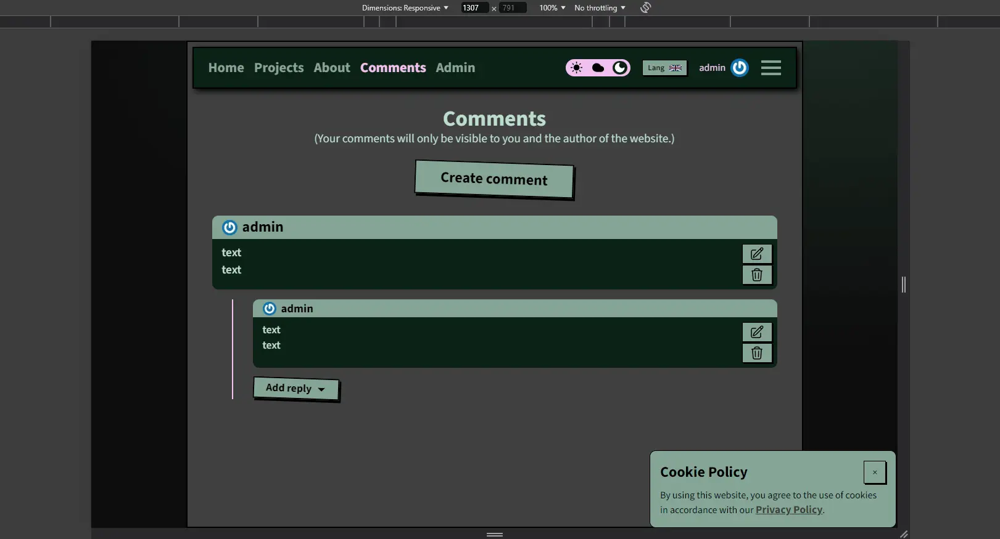

# Pet-projects aggregator (web-site)

### Video preview:

### Website:
https://pet-projects-aggregator.onrender.com

### Description:
This is a collection of educational projects with a short description and visualization of each one. Not all of them may be complete or working properly. The purpose of this site is to show progress and a timeline of changes. The site presents almost all projects from this GitHub account.

### Resources used:
- https://design.penpot.app/
- https://balsamiq.cloud/
- https://github.com/bodrovis-learning/RailsSeriesYT/tree/lesson_25/app
- https://www.youtube.com/playlist?list=PLWlFXymvoaJ_IY53-NQKwLCkR-KkZ_44-
- https://render.com
- chat gpt-4o
